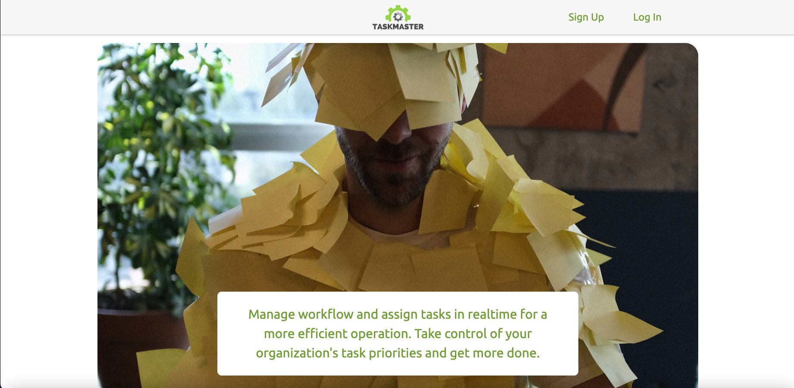
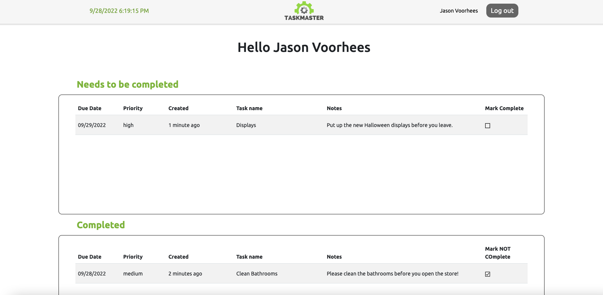

# TaskMaster
> A Full- Stack application for task managment using React, Node.js, Express, and MongoDB.






## Table of Contents
* [Description](#description)
* [Deployment](#deployment)
* [Dependencies](#dependencies)
* [Features](#features)
* [Setup](#setup)
* [Contributors](#contributors)

## Description
This web application that allows employers to track and assign tasks within various organizations.

## Deployment
Frontend Deployed (Client): AWS Amplify https://www.taskmasterusa.com/
Backend Deployed (Server Route): AWS Elastic Beanstalk  https://server.taskmasterusa.com
Database: Mongo DB Atlas Hosted Database

## Dependencies
This project was created with the following:

### Backend:
* "bcrypt": "^5.0.1",
* "body-parser": "^1.20.0",
* "cors": "^2.8.5",
* "dotenv": "^16.0.1",
* "env": "^0.0.2",
* "express": "^4.18.1",
* "jsonwebtoken": "^8.5.1",
* "mongoose": "^6.4.3",
* "nodemon": "^2.0.19",
* "validator": "^13.7.0"


### Frontend:
* "@emotion/react": "^11.10.4",
* "@emotion/styled": "^11.10.4",
* "@mui/icons-material": "^5.10.6",
* "@mui/material": "^5.10.6",
* "@testing-library/jest-dom": "^5.16.5",
* "@testing-library/react": "^13.4.0",
* "@testing-library/user-event": "^13.5.0",
* "axios": "^0.27.2",
* "bootstrap": "^5.2.1",
* "date-fns": "^2.29.3",
* "react": "^18.2.0",
* "react-bootstrap": "^2.5.0",
* "react-dom": "^18.2.0",
* "react-icons": "^4.4.0",
* "react-router-dom": "^6.4.0",
* "react-scripts": "5.0.1",
* "styled-components": "^5.3.5",
* "web-vitals": "^2.1.4",
* "xlsx": "^0.18.5"

## Features
* Login as a normal user, sign an organization up, or log in as an admin level user to control functionality across the application. Logins are protected with Bcrypt, JWT tokens, and validator.
* Styled components used for design in order to have custom React components and cut down on the Javascript build file.
* A button that has the functionality to export user data as an Excel file. 
* Deployed onto the web using AWS.

## Setup
To clone and run this application, you'll need [Git](https://git-scm.com) and [Node.js](https://nodejs.org/en/download/) (which comes with [npm](http://npmjs.com)) installed on your computer. From your command line:

```bash
# Clone this repository
$ git clone https://github.com/NJITFinalFour/TaskMaster.git

# Go into the repository
$ cd TaskMaster

# Go into the client and server folders
$ cd client
$ cd server

# Install dependencies in both folders
$ npm install

# Run command in both folders to run app (start with server first)
$ npm start

Once the dependencies are installed, you will be ale to access it at localhost:3000.
```

## Contributors
Created by
* [David Wendt](https://github.com/DavidWendtNJIT)
* [John Margotti](https://github.com/jgotti1)
* [Jonathan Shinault](https://github.com/JShinault0620)
* [Patrick Bowes](https://github.com/bowespa)

